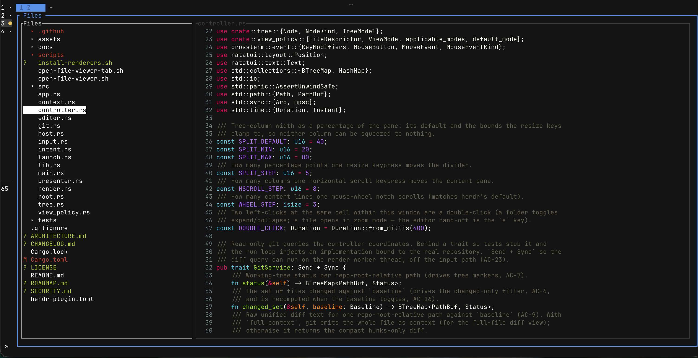

# herdr-file-viewer

[](https://github.com/smarzban/herdr-file-viewer/actions/workflows/ci.yml)
[](LICENSE)


**Browse your repo without leaving your terminal session — a git-aware, read-only file viewer
that lives in a herdr pane.** A keyboard-driven TUI with a directory tree
on the left and, on the right, exactly the view each file deserves: a **diff** if it changed,
**rendered markdown** if it's markdown, **syntax-highlighted code** otherwise. Git status is woven
right into the tree. It opens beside whatever you're doing and never touches your files.


*The right view per file — here a markdown file rendered (headings, inline code, tables) in your terminal's theme:*


*…and running full-screen — the same tree + content, filling the terminal:*



<!-- TODO: swap these stills for a short GIF (open → arrow to a changed file (diff) → `v` rendered markdown → `z` zoom). asciinema + agg → gif. -->

## Why you'd want it

- **The right view, automatically.** Stop `cat`-ing files and squinting at raw diffs. A changed
  file shows its diff; a README renders; code is highlighted — no mode-switching, no commands.
- **Git at a glance.** `M`/`A`/`D`/`?` markers, colored so changes pop, a changed-files-only
  filter, and a baseline you can flip between your branch's merge-base and `HEAD` — all in the
  tree, not a separate mode.
- **It sits beside your work.** Opens in a herdr split (or its own tab) with one keypress, and
  toggles away just as fast. Great next to an agent, a build, or an editor.
- **Safe on anything.** Read-only by construction and hardened to open *untrusted* repos (an
  agent's worktree, a fresh clone) without running repo-controlled code or letting hostile file
  content drive your terminal. See [SECURITY.md](SECURITY.md).
- **Keyboard-first**, mouse-optional, and it never reinvents rendering — it delegates to
  `glow` / `delta` / `bat` and degrades gracefully when they're absent.

## What it does

- **Tree, scoped to your work** — rooted at the worktree root inside a git repo, else the
  launch directory. Honors `.gitignore` (toggle to reveal ignored files), and a separate toggle
  (`.`) hides dot-prefixed "hidden" files when a directory is full of them. The tree's top border
  names the root directory and its bottom border shows the current branch, so you always know
  *where* and *on what branch* you're looking.
- **Jump to any file** — press `f` to open a fuzzy finder over every file in the tree
  (`.gitignore`-aware); type to filter, `↑` / `↓` to move, and `Enter` to open — far faster than
  scrolling the tree in a large repo.
- **Go to a line** — press `:` and type a line number to jump the content pane straight there;
  in a rendered-markdown or diff view it switches to the line-numbered content view to make the
  jump. Out-of-range clamps to the last line.
- **Search in a file** — press `/` to search the open file's content: every match highlights as
  you type, `Enter` commits, and `n` / `N` cycle through matches (wrapping at the ends). Smartcase —
  a lowercase query matches any case, add a capital to go case-sensitive — and it works in every
  view (code, markdown, or diff); `Esc` clears it.
- **Switch worktree on the fly** — press `W` to re-root the viewer at another git worktree of
  the repo without relaunching; it pre-selects the worktree a herdr agent is working in, so you
  can jump straight to it. Read-only — it changes only *what you're viewing*, never the branch
  or any files.
- **In-app help** — press `?` to open a view-only help overlay showing What's New (the latest
  changelog entries, rendered as markdown) and About (version, repo, license, and update status).
  Keyboard and mouse; `Esc` or `q` closes it. A `? help` hint rides the content pane's bottom
  border so the overlay is discoverable without already knowing the key.
- **Git woven in** — per-file status markers (`M`/`A`/`D`/`?`), and a `●` on a directory that
  contains any change; **colored** so changes read at a glance (changed files and dirty folders
  are red, new files green), with the glyph as a non-color cue so it survives a colorblind palette
  or a non-default theme. A changed-files-only filter; and a baseline you can switch between the
  merge-base of your branch and `HEAD`.
- **The right view per file** — a changed file shows its **diff**; a markdown file renders;
  anything else is shown as syntax-highlighted content with line numbers. Cycle the view
  (`v`) to override — a changed file can also show a **full-file diff**: the whole file with
  line numbers and the diff shown inline.
- **Navigable content** — scroll the content pane in all four directions, toggle line
  wrapping, resize the tree/content split, or zoom (`z`) to hide the tree and read a file
  full-screen; the layout reflows when the pane is resized. The tree scrolls to keep the
  selection in view (and sideways, for long names), and a scrollbar appears on the tree or
  content pane whenever there is more to see than fits — drag it with the mouse to scroll.
- **Keyboard-first** — every function has a key; no mouse required. The tree's horizontal
  scroll (for long / deeply-nested rows) is reachable with `H` / `L`, the same way the content
  pane scrolls with `←` / `→` when focused.

## Quick start

```bash
# 1. Install the plugin (downloads a prebuilt binary for released versions; otherwise builds from source):
herdr plugin install smarzban/herdr-file-viewer

# 2. (recommended) install the renderers, so markdown / diffs / code are styled, not plain text:
brew install glow git-delta bat     # macOS — or use your package manager
#   Linux / cross-platform: run scripts/install-renderers.sh from the plugin dir (`herdr plugin list`)
```

Then **bind a key** in your herdr config (`~/.config/herdr/config.toml`) so one press summons it:

```toml
[[keys.command]]              # open in a split beside your work
key = "prefix+f"
type = "shell"
command = "herdr plugin action invoke open-file-viewer --plugin herdr-file-viewer"

[[keys.command]]              # …or in its own tab
key = "prefix+shift+f"
type = "shell"
command = "herdr plugin action invoke open-file-viewer-tab --plugin herdr-file-viewer"
```

Run `herdr server reload-config`, then press your key. That's the whole setup — the split-pane
viewer and its open actions ship **inside** the plugin and register automatically on install, so
you only add the keybinding. The [keys](#keys) are below; deeper detail lives in the docs:
[install & updating](docs/install.md), [external renderers](docs/renderers.md), and
[summoning & keybindings](docs/usage.md).

## Keys

| Key | Action |
| --- | --- |
| `↑` / `k`, `↓` / `j` | Move the tree cursor — or **scroll the content pane** vertically when it is focused |
| `→` / `l` | Expand the selected directory — or **scroll the content pane right** when it is focused |
| `←` / `h` | Collapse the selected directory — or **scroll the content pane left** when it is focused |
| `H` (Shift+`h`) | Scroll the **tree** pane left (long / deeply-nested rows) — inert unless the tree is focused |
| `L` (Shift+`l`) | Focus-gated: with the **tree** focused, scroll it right (long / deeply-nested rows); with the **content pane** focused (or zoomed), enter **line-select mode** to copy a `file:line` reference (see below) |
| _line-select mode_ | `j`/`k` (or `↑`/`↓`) move the marker, `Shift`+move (`J`/`K`, Shift+`↑`/`↓`) extends the selection, `Enter` (or double-click) copies the `path:line` / `path:start-end` reference, `Esc` exits |
| `Enter` | Activate the selection — expand/collapse a directory, or open a file in **zoom mode** (content full-screen) |
| `i` | Toggle gitignored files |
| `.` | Toggle hidden (dot-prefixed) files and folders |
| `c` | Toggle changed-files-only |
| `b` | Toggle the diff baseline (base branch ⇄ `HEAD`) |
| `v` | Cycle the content view mode |
| `e` | Open the selected file in `$EDITOR` |
| `f` | **Go to file** — open a fuzzy finder over every file in the tree; type to filter, `↑` / `↓` move, `Enter` opens the selected file, `Esc` cancels (`←` / `→` scroll long paths) |
| `:` | **Go to line** — open a prompt and jump the content pane to a source line by number (`Enter` jumps, `Esc` cancels; out-of-range clamps to the last line). Works in any view; in a rendered-markdown or diff view, confirming switches to the line-numbered content view and jumps there |
| `/` | **Search in file** — open a prompt and highlight every match in the content pane as you type; `Enter` commits the search (highlights persist), `Esc` clears it and restores the scroll. Smartcase (a lowercase query is case-insensitive; a capital makes it case-sensitive). Works in any view |
| `n` / `N` (Shift+`n`) | After a committed search, jump to the **next** / **previous** match and scroll it into view — wrapping at the ends with a notice |
| `y` | Copy the selected file's **repo-relative** path to the clipboard (e.g. `src/app.rs`) |
| `Y` | Copy the selected file's **absolute** path to the clipboard |
| `Tab` | Move focus between the tree and content columns |
| `<` / `>` | Narrow / widen the tree column (move the divider) |
| `w` | Toggle line wrapping for the content pane |
| `z` | Zoom — hide the tree so the content pane fills the frame; press again (or `q`/`Esc`) to restore the two-column layout |
| `r` | Refresh git state — pick up changes made outside the viewer (a merge / pull / commit elsewhere) |
| `W` (Shift+`w`) | **Switch worktree** — open a picker of the repo's git worktrees and re-root the viewer to the one you pick (read-only; no branch checkout). Marks the current worktree and pre-selects the one with an active herdr agent; `↑`/`↓` move, `←`/`→` scroll long paths, `Enter` switches, `Esc` cancels |
| `?` (Shift+`/`) | Open the **help overlay** — What's New (latest changelog, rendered markdown) + About (version, repo, license, update status); `Esc` / `q` closes it |
| `u` | Dismiss the "update available" banner for this session |
| `q` / `Esc` | Back out of zoom if zoomed; otherwise close the viewer and return to the prior pane |

`Tab` to the content pane, then the arrow keys (or `h`/`j`/`k`/`l`) scroll it in all four
directions; `Tab` back to the tree to move between files. Long lines wrap in prose (markdown /
plain text); diffs and code keep their original lines so columns stay aligned — scroll
sideways with `←`/`→`, or press `w` to wrap them instead. The layout reflows automatically
when the pane is resized.

**Git state stays current.** The viewer re-reads git status when the pane **regains focus**, so
changes you make outside it (a merge, pull, or commit in another pane) show up automatically; `r`
forces a full refresh on demand. (Focus-refresh updates the tree's status without disturbing your
content scroll.)

Character keys act only when no control chord is held (so terminal chords like `Ctrl+C` are
never intercepted); `Shift` is permitted, for keys such as `<` and `>` (and `y`/`Y`, `W`, `N`,
`?`, `H`/`L`, and `J`/`K` in line-select mode).

**Copy a path (`y` / `Y`).** `y` copies the selected file's repo-relative path; `Y` copies its
absolute path — handy for pasting into a prompt, a command, or an agent. The copy uses the
terminal's **OSC 52** clipboard escape, so it travels through herdr (and SSH) to your real
clipboard with no extra tooling. A confirmation appears in the notices strip. If nothing lands
on your clipboard, your terminal likely needs OSC 52 / clipboard-write enabled (e.g. in tmux,
`set -g set-clipboard on`).

**Copy a line reference (`L`).** With the content pane focused (or zoomed), `L` enters
**line-select mode**: a marker lands on the top visible line, `j`/`k` (or `↑`/`↓`) move it, and
holding `Shift` (`J`/`K`, or Shift+`↑`/`↓`) extends the selection over a range. `Enter` — or a
double-click — copies a repo-relative reference to the clipboard: `src/app.rs:42` for a single
line, `src/app.rs:42-58` for a range. A mouse **click** places the marker, **Shift-click**
extends, and a **double-click** copies; `Esc` leaves the mode. The copy uses the same **OSC 52**
path as `y`/`Y`, so the reference is ready to paste straight into an agent chat or an issue to
point at exact lines. Because line numbers only map onto the source, entering line-select from a
rendered-markdown or diff view first switches that file to the line-numbered content view. With
the **tree** focused, `L` keeps its tree horizontal-scroll behavior instead — the mode is gated on
which pane has focus.

### Mouse

The viewer is keyboard-first; the mouse is additive and on by default:

| Gesture | Action |
| --- | --- |
| **Click** a tree row | Select it (focus the tree) |
| **Double-click** a folder | Expand / collapse it (same as `Enter`) |
| **Double-click** a file | Open it in **zoom mode** — content full-screen (same as `Enter`); the editor is the `e` key |
| **Wheel** over the content pane | Scroll it vertically; over the tree, move the selection |
| **Horizontal wheel / swipe** | Scroll the content — or the tree — sideways (terminal-dependent — see below) |
| **Drag** a scrollbar | Scroll that pane — drag ↕ on a vertical bar, ↔ on a horizontal bar; pressing the track jumps there |
| **Drag** the divider | Resize the tree / content split |

**`Shift`+drag is left to your terminal**, so its native select-and-copy still works while the
viewer owns ordinary clicks — herdr reserves `Shift`+mouse for exactly this. (herdr forwards
mouse events to the pane because the viewer requests capture.)

**Horizontal mouse scroll is terminal-dependent** — it works only where your terminal emits
horizontal-scroll events (`ScrollLeft` / `ScrollRight`); many terminals send nothing for a
sideways trackpad swipe. The `←` / `→` keys always scroll the content sideways, and `H` / `L`
always scroll the tree sideways, regardless of terminal.

### Opening in an editor

`e` hands the selected file to the editor named by the **`$EDITOR`** environment variable
(e.g. `vim`, or `"code --wait"` for editors that fork). The viewer suspends, runs the editor,
and resumes when it exits. If `$EDITOR` is unset, a notice is shown — the viewer never edits a
file itself.

**`e` does nothing, or says "no editor configured"?** The viewer reads `$EDITOR` from the
**herdr server's** environment — the server spawns every pane — *not* from the shell you happen to
be attached from. So if `$EDITOR` is set in your interactive shell but the server was started
without it (common with `mosh`, `systemd`, or any login manager that doesn't source your shell
startup files), the viewer won't see it. To fix it:

1. **Export `$EDITOR` in the startup file your server's launch actually reads.** Pick the line(s)
   that match how herdr starts on your machine:

   ```bash
   # zsh — interactive shells read ~/.zshrc; ~/.zshenv is read by *every* zsh invocation
   echo 'export EDITOR=vim' >> ~/.zshrc

   # bash — add to both, so interactive and login shells agree
   echo 'export EDITOR=vim' >> ~/.bashrc
   echo 'export EDITOR=vim' >> ~/.profile

   # mosh / `sh -lc` / any POSIX login-shell launch (e.g. herdr started over SSH+mosh)
   echo 'export EDITOR=vim' >> ~/.profile
   ```

   If you're unsure which applies, adding it to **`~/.profile`** covers the login-shell launch
   paths; keep it in your shell's rc too for interactive use.

2. **Restart the herdr server** so it re-reads the environment — `reload-config` and `prefix+q`
   are **not** enough (the first doesn't re-read env; the second only quits the client and leaves
   the detached server running with its old environment):

   ```bash
   herdr server stop   # stops the background daemon — ends all panes, so finish in-flight work first
   herdr               # relaunch from a shell where `echo $EDITOR` already prints your editor
   ```

3. **Verify:** open any shell pane *inside* herdr and run `echo $EDITOR`. Once that prints your
   editor (it was empty before), `e` will open it. (A future settings file will also let you set
   the editor command directly — see [Roadmap](#roadmap).)

## Documentation

- **[Install & updating](docs/install.md)** — prebuilt vs. source, pinning a version, local-dev linking, and how updates surface (the in-app "update available" banner).
- **[External renderers](docs/renderers.md)** — the optional `glow` / `delta` / `bat` integrations and the plain-text fallback when they're absent.
- **[Summoning & keybindings](docs/usage.md)** — the open actions, the idempotent launcher, split vs. tab, and the `--remote` caveat.
- **[Architecture](ARCHITECTURE.md)** — one in-process TUI owning both columns, the component map, off-thread rendering, and the load-bearing decisions (read-only, delegate rendering, git-first).
- **[Security](SECURITY.md)** — the threat model and mitigations for opening untrusted content, and how to report a vulnerability.

## Roadmap

A few things on the way:

- **Settings & customization** — a config file for keymaps, the default split, themes, and your own renderer/editor commands.

**Hit a bug, or want a feature?** Please [open an issue](https://github.com/smarzban/herdr-file-viewer/issues) — bug reports and feature requests are very welcome.

## Development

This crate is a library (`src/lib.rs` + modules) plus a thin binary (`src/main.rs` →
`run()`), so the components are unit-testable.

```bash
cargo test                 # unit + integration + e2e (pty) tests
cargo build --release      # what herdr's [[build]] step runs
cargo run                  # run the viewer locally, outside herdr
```

The e2e tests drive the real binary over a pseudo-terminal; they stub the editor via
`$EDITOR` and run in temporary directories, so they need neither glow/delta/bat nor a live
herdr.

## License

[MIT](LICENSE) © Saeed Marzban
