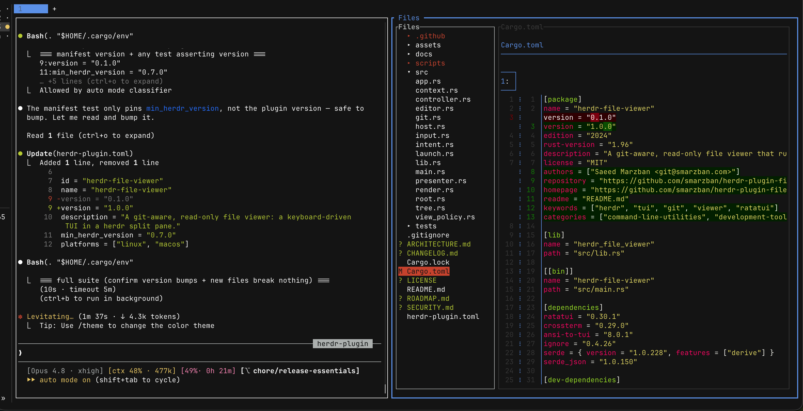
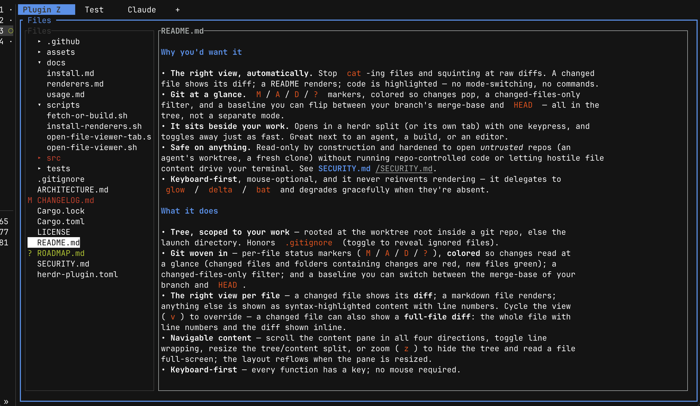

# herdr-file-viewer

[](https://github.com/smarzban/herdr-file-viewer/actions/workflows/ci.yml)
[](LICENSE)


-informational)

**Browse your repo without leaving your terminal session: a git-aware, read-only file viewer
that lives in a herdr pane.** A keyboard-driven TUI with a directory tree
on the left and, on the right, exactly the view each file deserves: a **diff** if it changed,
**rendered markdown** if it's markdown, **syntax-highlighted code** otherwise. Git status is woven
right into the tree. It opens beside whatever you're doing and never touches your files.



*The right view per file, here a markdown file rendered (headings, inline code, tables) in your terminal's theme:*



## Why you'd want it

- **The right view, automatically.** Stop `cat`-ing files and squinting at raw diffs. A changed
  file shows its diff; a README renders; code is highlighted: no mode-switching, no commands.
- **Git at a glance.** `M`/`A`/`D`/`?` markers (colored, with the glyph as a non-color cue), a
  changed-files-only filter, and a baseline you can flip between your branch's merge-base and
  `HEAD` — all in the tree, not a separate mode.
- **It sits beside your work.** Opens in a herdr split (or its own tab) with one keypress, and
  toggles away just as fast. Great next to an agent, a build, or an editor.
- **Safe on anything.** Read-only by construction and hardened to open *untrusted* repos (an
  agent's worktree, a fresh clone) without running repo-controlled code or letting hostile file
  content drive your terminal. See [SECURITY.md](SECURITY.md).
- **Keyboard-first**, mouse-optional, and it never reinvents rendering: it delegates to
  `glow` / `delta` / `bat` and degrades gracefully when they're absent.

## Highlights

A taste of what the keys do — the [full key & mouse reference](docs/keys.md) has them all, and the
[usage guide](docs/usage.md) walks through each feature:

| Key | Does |
| --- | --- |
| `f` | Fuzzy-find any file in the tree |
| `v` | Cycle the view (diff ⇄ rendered ⇄ syntax) |
| `b` | Flip the diff baseline: your branch's merge-base ⇄ `HEAD` |
| `W` | Switch to another git worktree, in place |
| `L` | Copy a `path:line` reference (or the selected lines) to your clipboard |
| `Z` | Full-screen the current file |
| `e` / `O` / `R` | Hand off: open in `$EDITOR` / the OS default app / the file manager |
| `?` | Help overlay: keys, what's new, settings, about |

## Quick start

```bash
# 1. Install the plugin (downloads a prebuilt binary for released versions; otherwise builds from source):
herdr plugin install smarzban/herdr-file-viewer

# 2. (recommended) install the renderers, so markdown / diffs / code are styled, not plain text:
brew install glow git-delta bat     # macOS, or use your package manager
#   Linux / cross-platform: run scripts/install-renderers.sh from the plugin dir (`herdr plugin list`)
```

Then **bind a key** in your herdr config (`~/.config/herdr/config.toml`) so one press summons it:

```toml
[[keys.command]]              # open in a split beside your work
key = "prefix+f"
type = "shell"
command = "herdr plugin action invoke open-file-viewer --plugin herdr-file-viewer"

[[keys.command]]              # …or in its own tab
key = "prefix+shift+f"
type = "shell"
command = "herdr plugin action invoke open-file-viewer-tab --plugin herdr-file-viewer"
```

Run `herdr server reload-config`, then press your key. That's the whole setup: the split-pane
viewer and its open actions ship **inside** the plugin and register automatically on install, so
you only add the keybinding.

Deeper detail lives in the docs: [install & updating](docs/install.md),
[summoning the viewer](docs/summoning.md) (split vs. tab, the launcher, `--remote`),
[external renderers](docs/renderers.md), and the [keys reference](docs/keys.md).

## Configuration

An optional, **read-only** TOML config file lets you override the editor, the renderer/opener
commands, a couple of startup toggles, the tree layout, and the keybindings. A fully-commented
[`config.example.toml`](config.example.toml) ships in the plugin folder — copy it to the config
path, rename it to `config.toml`, and uncomment what you want.

The full reference — file location, precedence, every key, and `[keys]` remapping — is in
**[docs/configuration.md](docs/configuration.md)**. See your effective settings any time in the `?`
help overlay's **Settings** section.

## Windows

Native Windows is supported as a **preview** (install works the same way; the open actions use
`-windows` action ids and a `prefix+f` keybinding needs herdr v0.7.2+). WSL works today with zero
extra setup. See [docs/windows.md](docs/windows.md).

## Documentation

Full docs live in **[docs/](docs/README.md)**:

- **[Install & updating](docs/install.md)** — prebuilt vs. source, pinning a version, local-dev linking, and the in-app update banner.
- **[Summoning the viewer](docs/summoning.md)** — the open actions, the idempotent launcher, split vs. tab, and the `--remote` caveat.
- **[Usage guide](docs/usage.md)** — a feature-by-feature tour of the whole viewer.
- **[Keys & mouse](docs/keys.md)** — the complete key table, mouse gestures, and editor hand-off.
- **[Configuration](docs/configuration.md)** — the full `config.toml` reference and `[keys]` remapping.
- **[External renderers](docs/renderers.md)** — the optional `glow` / `delta` / `bat` integrations and the plain-text fallback.
- **[Windows (preview)](docs/windows.md)** — native-Windows specifics and WSL.
- **[Architecture](ARCHITECTURE.md)** — one in-process TUI owning both columns, the component map, and the load-bearing decisions.
- **[Security](SECURITY.md)** — the threat model for opening untrusted content, and how to report a vulnerability.

## Contributing

Bug reports and feature requests are very welcome — please
[open an issue](https://github.com/smarzban/herdr-file-viewer/issues). To build, test, and send a
change, see [CONTRIBUTING.md](CONTRIBUTING.md).

## License

[MIT](LICENSE) © Saeed Marzban
