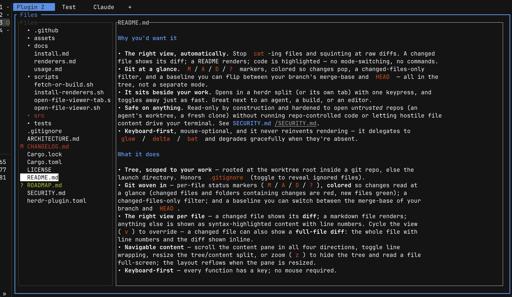

# herdr-file-viewer

[](https://github.com/smarzban/herdr-file-viewer/actions/workflows/ci.yml)
[](LICENSE)


-informational)

**A git-aware, read-only file viewer in a herdr pane.** Tree on the left. On the right, the view
that file deserves: a **diff** if it changed, **rendered markdown**, or **highlighted code**.
Agents can drop you on a file or a line. You pin one file, mark a range, and paste those notes
back into the chat. It never touches your files.


*The right view per file, here a markdown file rendered (headings, inline code, tables) in your terminal's theme:*



*…and running full-screen, the same tree + content, filling the terminal:*


*Pin a file with `p` and keep browsing: tree, the file you are on, and a frozen `Pinned: [main]` beside it:*


## Why you'd want it

- **The right view, automatically.** A changed file opens as a diff. A README renders. Code is
  highlighted. No `cat`, no mode switch, no commands. Press `v` only when you want something else.
- **Git in the tree.** `M`/`A`/`D`/`?` on every row, a changed-only filter (`c`), jump next/prev
  changed file (`]`/`[`), flip the baseline between your branch and `HEAD` (`b`). Not a separate
  git client.
- **Pin one file, keep browsing.** `p` freezes it on the right. Switch worktree (`W`) and compare
  it with another checkout, or pin the old version and walk the new one.
- **Agents show you the spot. You send notes back.** Teach them the [bundled skill](skills/herdr-file-viewer/SKILL.md)
  and "open `src/app.rs:42` in Files" lands you there. Mark a file or a range (`a`), copy the
  notes (`A` then `y`), paste them into the chat.
- **Edit in *your* editor.** `e` suspends the viewer and opens the file in neovim, vim, micro, or
  whatever you set as `editor` (else `$EDITOR`). You change the file there; the viewer never writes
  it, and comes back when you quit the editor.
- **Beside your work, safe on anything.** One keypress in a herdr split (or its own tab). Read-only,
  hardened for an agent's worktree or a fresh clone. Delegates rendering to `glow` / `delta` / `bat`.
  See [SECURITY.md](SECURITY.md).

## Highlights

A taste of what the keys do — the [full key & mouse reference](docs/keys.md) has them all, and the
[usage guide](docs/usage.md) walks through each feature:

| Key | Does |
| --- | --- |
| `f` | Fuzzy-find any file in the tree |
| `p` | Pin the current file and keep browsing (compare across worktrees with `W`) |
| `a` / `A` | Annotate a file or range; copy the notes out for an agent |
| `v` | Cycle the view (diff ⇄ rendered ⇄ syntax) |
| `]` / `[` | Jump to the next / previous changed file |
| `b` | Flip the diff baseline: your branch's merge-base ⇄ `HEAD` |
| `W` | Switch to another git worktree, in place |
| `L` | Copy a `path:line` reference (or the selected lines) |
| `Z` | Full-screen the current file |
| `e` / `O` / `R` | Hand off: editor / OS default app / file manager |
| `?` | Help overlay: What's New, keys, settings, about |

## Quick start

```bash
# 1. Install the plugin (downloads a prebuilt binary for released versions; otherwise builds from source):
herdr plugin install smarzban/herdr-file-viewer

# 2. (recommended) install the renderers, so markdown / diffs / code are styled, not plain text:
brew install glow git-delta bat     # macOS, or use your package manager
#   Linux / cross-platform: run scripts/install-renderers.sh from the plugin dir (`herdr plugin list`)
```

Then **bind a key** in your herdr config (`~/.config/herdr/config.toml`) so one press summons it:

```toml
[[keys.command]]
key = "prefix+f"
type = "plugin_action"
command = "herdr-file-viewer.open-file-viewer"
description = "open file viewer in split"

[[keys.command]]
key = "prefix+shift+f"
type = "plugin_action"
command = "herdr-file-viewer.open-file-viewer-tab"
description = "open file viewer in tab"

[[keys.command]]
key = "prefix+alt+f"
type = "plugin_action"
command = "herdr-file-viewer.open-file-viewer-overlay"
description = "open file viewer as overlay"
```

Run `herdr server reload-config`, then press your key. That's the whole setup: the split-pane
viewer and its open actions ship **inside** the plugin and register automatically on install, so
you only add the keybinding.

Deeper detail lives in the docs: [install & updating](docs/install.md),
[summoning the viewer](docs/summoning.md) (split vs. tab vs. overlay, the launcher, `--remote`),
[external renderers](docs/renderers.md), and the [keys reference](docs/keys.md).

## Configuration

An optional, **read-only** TOML config file lets you override the editor, the renderer/opener
commands, a couple of startup toggles, the tree layout, and the keybindings. A fully-commented
[`config.example.toml`](config.example.toml) ships in the plugin folder; copy it as `config.toml`
into the directory `herdr plugin config-dir herdr-file-viewer` prints, then uncomment what you want.

The full reference — file location, precedence, every key, and `[keys]` remapping — is in
**[docs/configuration.md](docs/configuration.md)**. See your effective settings any time in the `?`
help overlay's **Settings** section.

## Windows

Native Windows is supported as a **preview** (install works the same way; the open actions use
`-windows` action ids and herdr's preview channel). WSL works today with zero extra setup. See
[docs/windows.md](docs/windows.md).

## Documentation

Full docs live in **[docs/](docs/README.md)**:

- **[Install & updating](docs/install.md)** — prebuilt vs. source, pinning a version, local-dev linking, and remote notices.
- **[Summoning the viewer](docs/summoning.md)** — the open actions, the idempotent launcher, split vs. tab, and the `--remote` caveat.
- **[Usage guide](docs/usage.md)** — a feature-by-feature tour of the whole viewer.
- **[Keys & mouse](docs/keys.md)** — the complete key table, mouse gestures, and editor hand-off.
- **[Configuration](docs/configuration.md)** — the full `config.toml` reference and `[keys]` remapping.
- **[External renderers](docs/renderers.md)** — the optional `glow` / `delta` / `bat` integrations and the plain-text fallback.
- **[Windows (preview)](docs/windows.md)** — native-Windows specifics and WSL.
- **[Architecture](ARCHITECTURE.md)** — one in-process TUI owning both columns, the component map, and the load-bearing decisions.
- **[Security](SECURITY.md)** — the threat model for opening untrusted content, and how to report a vulnerability.

## Contributing

Bug reports and feature requests are very welcome — please
[open an issue](https://github.com/smarzban/herdr-file-viewer/issues). To build, test, and send a
change, see [CONTRIBUTING.md](CONTRIBUTING.md).

## License

[MIT](LICENSE) © Saeed Marzban
